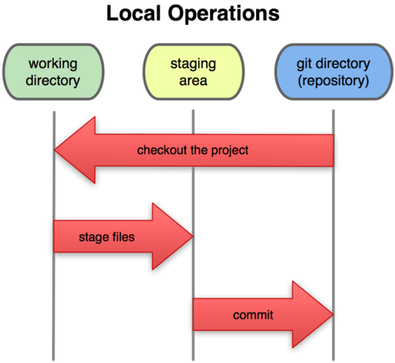

# Tutorial GIT.

*Tutorial GIT* es una guía básica para comprender y usar las principales funcionalidades del sistema de control de versiones *Git*.

 


## Desarrolladores.

* [Ing. Edgard Decena.](mailto:edecena@gmail.com)
* [Ing. Luís Acevedo.](mailto:laar19@protonmail.com)


## ¿Qué es GIT?

[GIT](https://git-scm.com/book/es/v2) es un [sistema de control de versiones](https://es.wikipedia.org/wiki/Control_de_versiones) que nos permite:

1. Trabajar en equipo de forma remota, simple y óptima mientras estamos desarrollando software.

2. Controlar todos los cambios en el código fuente, pudiendo volver atrás en el tiempo y abrir diferentes ramas de desarrollo.


## Instalación y configuración.

Para instalar *Git* en un sistema operativo *Linux* con paquetería *apt* (*Debian*, *Ubuntu*, etc) basta con ejecutar la siguiente instrucción desde la terminal:

```bash
sudo apt-get install git
```
Para la instalación en otros sistemas operativos se puede consultar [**aquí**](https://git-scm.com/book/es/v2/Inicio---Sobre-el-Control-de-Versiones-Instalación-de-Git).

Luego de la instalación deberán establecerse las variables de configuración de *Git* para personalizar el entorno de trabajo. Es necesario hacer esta configuración **solamente una vez** en el computador, ya que estas variables se mantendrán entre actualizaciones. También se pueden cambiar estas variables en cualquier momento, volviendo a ejecutar los comandos correspondientes.

*Git* trae una herramienta llamada `git config`, que nos permite establecer y obtener variables de configuración; dichas variables de configuración controlan el aspecto y funcionamiento de *Git.*

### Estableciendo la identidad del usuario.

Lo primero que debe hacerse luego de instalar *Git* es establecer la **identidad** del usuario. Esto es importante porque los *commits* de *Git* usan esta información que es introducida de manera automática en todos los *commits* que se hagan en el repositorio.

Las principales variables de configuración son el **nombre de usuario** y el **email**. Para establecerlos hay que ejecutar en la terminal las siguientes instrucciones:

```bash 
git config --global user.name "Pedro Pérez"
git config --global user.email pedro.perez@gmail.com
```
Para comprobar la configuración se puede usar el comando `git config --list`, el cual mostrará los cambios recientes además de las variables de configuración adicionales:

```bash
git config --list
user.name=Pedro Pérez
user.email=pedro.perez@gmail.com
color.status=auto
color.branch=auto
color.interactive=auto
color.diff=auto
```

### Obteniendo ayuda.

Para obtener ayuda de cualquier comando de *Git* podemos usar:
```bash
git help [comando]
```
Sin embargo, existen dos formas adicionales para obtener ayuda de *Git* que se pueden consultar [**aquí**](https://git-scm.com/book/es/v2/Inicio---Sobre-el-Control-de-Versiones-¿Cómo-obtener-ayuda%3F)


## Crear nuevos repositorios.

Con *Git*  se puede crear un nuevo repositorio básicamente de dos maneras:

1. Convirtiendo una carpeta (directorio) en repositorio ejecutando la instrucción `git init` dentro del directorio; o también, si el directorio no existe, puede crearse con el comando `git init [nuevo_repositorio]` que automáticamente creará el nuevo_repositorio.

2. La otra forma de crear un nuevo repositorio es *clonándolo* desde otra ubicación con el comando `git clone [nombre_repositorio] [dirección URL/URI]`. Por defecto *Git* establece [nombre_repositorio] a *origin* si no se especifica. Por ejemplo, para clonar este repositorio localmente basta con hacer `git clone https://github.com/ejdecena/tutorial_git.git`, el cual creará un directorio local con el nombre de *tutorial_git*. Si se quiere clonar el repositorio a un directorio con otro nombre distinto al original, se puede especificar un tercer parámetro al comando `git clone [nombre_repositorio] [dirección URL/URI] [nombre_directorio]`. Por ejemplo el comando `git clone https://github.com/ejdecena/tutorial_git.git mi_repo` creará el directorio `mi_repo` con el repositorio clonado.


## Flujo de trabajo local.

Los archivos en *Git* pasan por 3 fases diferentes en forma local:

1. **_Working Directory_** (Directorio de Trabajo).
2. **_Staging Área_** (Área de Preparación o *Index*).
3. **_Git Repository_** (Repositorio Git o *HEAD*).

La siguiente figura muestra el esquema de flujo de trabajo local de *Git*:



### Fase 1: "Working Directory".

En esta fase podemos hacer cualquier cambio en los archivos y no afectar nuestro repositorio (*Git Repository*) en lo absoluto. En cuanto modificamos algo en nuestro código, éste tendrá status de *modificado*. Si ejecutamos el comando `git status` nos mostrará qué archivos han sido modificados (creados o eliminados).

Una vez que hemos hecho los cambios necesarios, pasamos nuestros archivos al *Staging Area* (*Index*) con el comando `git add archivo.py`. Si existen más archivos modificados que queramos pasar podemos listarlos con `git add archivo1.py archivo2.py ...`, o también con el comando `git add .` agregamos **todos** los archivos modificados del *Working Directory* al *Staging Area*.

Cuando se pasan los archivos del *Working Directory* al *Staging Area*, se cambia el estado del código de *modificado* a *preparado*. Para **deshacer** los cambios en el *Working Directory* con el último *commit* debe usarse el comando `git checkout -- [archivo]`. Los archivos que estén en el *Staging Area* no serán modificados.

### Fase 2: "Staging Area".

Para pasar nuestro código del *Staging Area* al *Git Repository* lo hacemos con el comando `git commit -m "[descripción del commit]"`. Hay distintas modalidades para el comando `git commit`que pueden leerse [**aquí**](https://git-scm.com/book/es/v2/Fundamentos-de-Git-Guardando-cambios-en-el-Repositorio). Cuando hacemos el `commit` el código pasa del estado *preparado* a *confirmado*. Para **devolver** un archivo del *Staging Área* al *Working Directory* debe ejecutarse `git reset HEAD [archivo]`.

### Fase 3: "Git repository".

Una vez que el código esta *confirmado* ya está listo para actualizarse con un servidor remoto de *Git* (GitHub, GitLab, Bitbucket, etc.) como veremos más adelante.

### Ignorar archivos.

A veces será deseable que *Git* no añada algunos archivos o directorios al *Working Directory*, o que simplemente estos archivos o directorios no aparezcan como no rastreados. Este suele ser el caso de archivos generados automáticamente o archivos de backup, etc. En estos casos, puedes crear un archivo llamado `.gitignore` que liste patrones a considerar para evitar que estos archivos sean tomados en cuenta por *Git*. Podemos encontrar varios ejemplos del archivo `.gitignore` [**aquí**](https://git-scm.com/book/es/v2/Fundamentos-de-Git-Guardando-cambios-en-el-Repositorio).

En general el **flujo de trabajo** local básico en *Git* podríamos resumirlo de la siguiente manera:

1. Modificas una serie de archivos en el *Working Directory*.
2. Preparas los archivos añadiéndolos al *Staging Area* con `git add`.
3. Confirmas los cambios con `git commit`, pasando los archivos al *Git Repository* y haciendo de este modo una copia instantánea y permanente en tu directorio de *Git*.

En algunos casos el paso 2, pasar los archivos al *Staging Area*, puede omitirse del *flujo de trabajo*, de tal manera que podemos pasar los archivos **directamente** del *Working Directory* al *Git Reposiory* añadiendo la opción `-a` al comando `git commit`.

### Ejemplos de flujo de trabajo local.

1. Agrega el archivo del *Working Directory* al *Staging Area* y luego al *Git Repository* (ruta completa):
```bash
git add archivo1.py
git commit -m "Corrección de error."
```
2. Agrega los archivos del *Working Directory* al *Staging Area* y luego al *Git Repository* (ruta completa):
```bash
git add archivo1.py archivo2.py archivo3.py
git commit -m "Agregando nueva función."
```
3. Agrega **todos** los cambios del *Working Directory* al *Staging Area* y luego al *Git Repository* (ruta completa):
```bash
git add .
git commit -m "Se refactorizó las clases no asociadas."
```
4. Agrega todos los cambios del *Working Directory* **directamente** al *Git Repository* (se omite el paso 2 pero ruta completa):
```bash
git commit -am "Cambio de formatos."
```
5. Agrega los `archivo1.py` y `archivo2.py` del *Working Directory* al *Git Repository*, luego se arrepiente y devuelve el archivo1.py al *Working Area* para finalmente pasar solo el archivo2.py al *Git Repository* (ruta incompleta):
```bash
git add archivo1.py archivo2.py
git reset HEAD archivo1.py
git commit -m "Corrección del error en el archivo2.py"
```
6. Igual que el ejemplo anterior, luego del *commit* modifica el `archivo2.py`, se arrepiente de los cambios y lo restituye con la versión del repositorio:
```bash
git add archivo1.py archivo2.py
git reset HEAD archivo1.py
git commit -m "Corrección del error en el archivo2.py"
# luego modifica el archivo2.py en el *Working Directory*
git checkout -- archivo2.py
```
Como podemos notar, en el *flujo de trabajo* local básico solo manejamos 4 comandos:
1. `git add` para pasar los cambios del *Working Directory* al *Staging Area*.
2. `git commit` para pasar los cambios del *Staging Area* al *Git Repository*.
3. `git reset HEAD` para **retroceder** y pasar los cambios del *Staging Area* al *Working Directory*
4. `git checkout --` para **retroceder** y pasar los cambios del *Git Repository* al *Working Directory*.

## Herramientas adicionales.

Los 4 comandos de la sección anterior son básicos para el *flujo de trabajo* local y de algún modo son suficientes, pero existen 3 comandos adicionales que **complementan** las tareas: `git diff`, `git log` y `git tag`.

### Observando las diferencias entre archivos.

Siempre es posible ver los cambios o diferencias de los archivos en las distintas fases, por ejemplo:
* `git diff` muestra las diferencias entre los archivos entre el *Working Directory* y *Staging Area*. 
* `git diff --staged` muestra las diferencias entre los archivos entre el *Staging Area* y el *Git Repository*.

### Observando la historia de commits.

También siempre es posible ver el *historial* de cambios del repositorio *Git Repository* con el comando `git log`. Este comando tiene múltiples opciones las cuales pueden leerse [**aquí**](https://git-scm.com/book/es/v2/Fundamentos-de-Git-Ver-el-Historial-de-Confirmaciones).

### Añadiendo tags a los commits.

Cuando vemos el historial de los *commits* con `git log` podemos ver algo como esto:
```bash
commit eece07985eec4d1ccad5cd8022e6a806086dcbd2
Author: Edgard Decena <edecena@gmail.com>
Date:   Thu Sep 26 04:37:46 2019 -0400

    Más ejemplos y resumiendo el flujo de trabajo local básico.

commit 81d19320683852a928d35759b7173b098ac1d126
Author: Edgard Decena <edecena@gmail.com>
Date:   Wed Sep 25 23:38:10 2019 -0400

    Correcciones varias.

commit c0961e1ee659f56713e7389fc1e293ff1f68883b
Author: Edgard Decena <edecena@gmail.com>
Date:   Wed Sep 25 23:34:52 2019 -0400

    Agregando subtítulos de diff, log y tag. Arreglos varios.
```
Sin embargo se recomienda crear **etiquetas** (*tags*) para aquellos *commits* que marquen un *hito* o que sean importantes, como por ejemplo una **versión** del software. Para crear las etiquetas se usa el comando `git tag`. Veamos el siguiente ejemplo:
```bash
git tag 1.0.0 eece07985e
```
Agrega la etiqueta `1.0.0` al primer commit, el marcado con `eece07985eec4d1ccad5cd8022e6a806086dcbd2`. Nótese que solo usamos los 10 primeros caracteres del hash. El comando `git tag` tiene múltiples opciones las cuales pueden leerse [**aquí**](https://git-scm.com/book/es/v2/Fundamentos-de-Git-Etiquetado). 

## Creación y gestión de ramas.

El manejo de *ramas* es muy sencillo en *Git* y básicamente se reduce a 3 comandos:

* `git branch [nombre_rama]` **crea** la rama `nombre_rama`. Si se omite el parámetro `nombre_rama` el comando muestra todas las ramas del repositorio.
* `git checkout [nombre_rama]` nos **cambia** a la rama `nombre_rama`.
* `git checkout -b [nombre_rama]` **crea** la rama `nombre_rama` y nos **cambia** de una vez a la rama.
* `git checkout -d [nombre_rama]` **elimina** la rama [nombre_rama].

Siempre vamos a tener una rama `master` que será la rama principal. Supongamos que creamos la rama `desarrollo` para hacer pruebas:
```bash
git checkout -b desarrollo
```
En `desarrollo` creamos nuevos archivos y modificamos archivos ya existentes. Para **unir** (*merge*) estos cambios a la rama `master` primero tenemos que hacer *commit* en `desarrollo` y luego **cambiarnos** a la rama `master` así:
```bash
git commit -am "Agregando cambios finales a desarrollo."
git checkout master
```
Estando ya en la rama `master` podemos **unir** (*merge*) los cambios en `desarrollo` así:
```bash
git merge desarrollo
```
Luego si todo fue OK podemos eliminar la rama `desarrollo` así:
```bash
git checkout -d desarrollo
```
Cuando se hace el *merge* es posible que hayan conflictos al tratar de cambiar archivos que ya tengan otros cambios, estos conflictos deberán resolverse manualmente antes de intentar un nuevo *merge*. Para obtener más información sobre el manejo de las ramas podemos ir [**aquí**](https://git-scm.com/book/es/v2/Ramificaciones-en-Git-¿Qué-es-una-rama%3F).

## Agregar y gestionar repositorios remotos.
[en progreso]

## Participando en proyectos de GitHub.
[en progreso]
[Guías de GitHub](https://guides.github.com/)